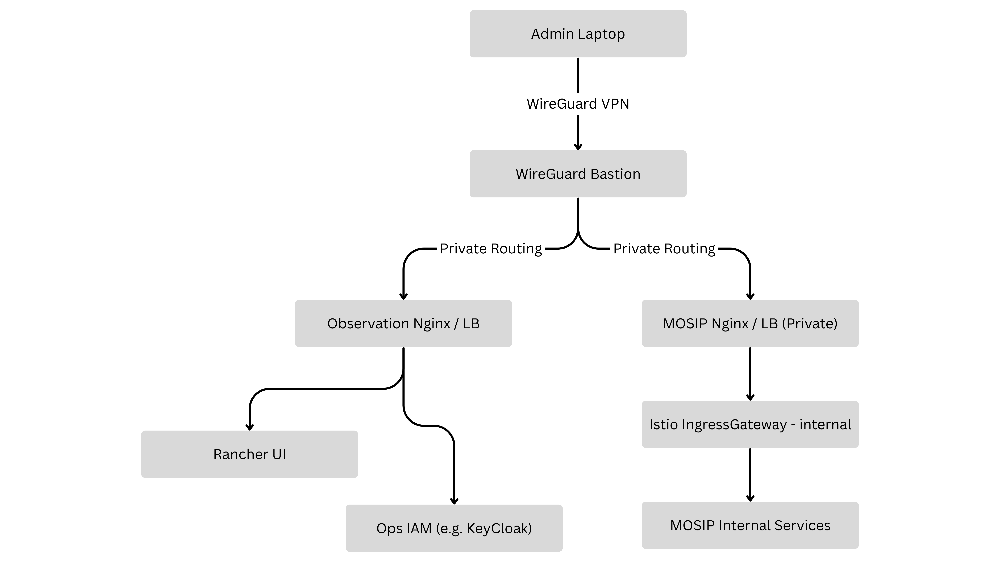

# Deployment Topology & Network Plan

This page describes **where components are deployed, how we secure administrative access, and how DNS and ingress** routes traffic across the **Observation** and **MOSIP** Kubernetes clusters for São Tomé & Príncipe (STP).

***

### 1. Why this topology

We use a **two-cluster model**:

* **Observation Cluster**: hosts operational tooling (cluster management, ops dashboards, ops IAM).
* **MOSIP Cluster**: hosts MOSIP platform workloads and MOSIP-facing endpoints.


**Why two clusters?**\
Keeping “operations” components separate from “mission” components reduces blast radius, allows tighter network policy for admin tools, and prevents ops UI upgrades/changes from impacting MOSIP runtime.


***

### 2. Logical architecture

#### 2.1 Core components

1. **WireGuard Bastion (Admin VPN)**
   * Provides secure private access from admin machines into private subnets.
   * Reference: WireGuard Quick Start — https://www.wireguard.com/quickstart/


**Why WireGuard?**\
WireGuard is a modern VPN designed to be simpler and easier to audit than many alternatives, making it suitable for tightly controlled administrative access into private environments.


2.  **Observation Cluster (Kubernetes)**

    * **Rancher** (cluster management UI)
    * **Ops IAM** (e.g., Keycloak) for admin authentication (if used)
    * **Private Ingress** (nginx-ingress) for private dashboards

    References:

    * RKE1 docs (Rancher) — https://rke.docs.rancher.com/installation
    * ingress-nginx (official GitHub) — https://github.com/kubernetes/ingress-nginx


**Why Rancher/Observation tooling?**\
A centralized cluster management plane reduces operational friction (access, monitoring, node lifecycle, kubeconfig management) and improves auditability. Keeping it private reduces exposure.


3.  **MOSIP Cluster (Kubernetes)**

    * **Istio gateways** for controlled ingress into MOSIP services
    * **MOSIP Nginx LB / reverse proxy** (VM-based) for stable edge routing and TLS termination
    * **Persistent storage** via NFS (server VM + client provisioner) for stateful workloads where required

    References:

    * Istio: Install with istioctl — https://istio.io/latest/docs/setup/install/istioctl/
    * NGINX Documentation — https://docs.nginx.com/
    * NFS subdir external provisioner (kubernetes-sigs) — https://github.com/kubernetes-sigs/nfs-subdir-external-provisioner


**Why Istio gateways?**\
Gateways provide explicit, policy-driven ingress control (routing and isolation between internal and external endpoints) and a clean separation between exposure (Gateways) and routing rules (VirtualServices).



**Why a VM-based Nginx LB in front?**\
In on‑prem or hybrid setups, a VM-based reverse proxy can be the simplest stable “edge” to manage DNS, TLS certificates, allowlists, and exposure policy in one place, independent of cluster churn.



**Why NFS for PVs?**\
NFS is a pragmatic shared storage backend for on‑prem Kubernetes when you need ReadWriteMany-style storage without a full distributed storage platform.


***

### 3. Network zones and access policy

#### 3.1 Recommended zones (conceptual)

* **Admin Zone**: admin laptops / CI runners
* **Bastion Zone**: WireGuard VM (public IP) + admin jump access
* **Private Cluster Zone**: Observation & MOSIP cluster nodes, private LBs, NFS VM(s)
* **Public Zone**: only selected MOSIP endpoints that must be internet-accessible

#### 3.2 Baseline access rules

* **Private endpoints** (Rancher, ops IAM, `admin.*`, `api-internal.*`, internal dashboards) are reachable **only via WireGuard** and/or a strict **admin CIDR allowlist**.
* **Public endpoints** (e.g., `api.<env>.<domain>`, `resident.<env>.<domain>` if in scope) must be protected with:
  * TLS (strong ciphers)
  * WAF / rate limits (where available)
  * IP allowlisting for partner APIs when feasible


**Why “VPN first” for admin surfaces?**\
Admin UIs expose privileged operations and sensitive data paths. Keeping them off the public internet significantly reduces the attack surface and simplifies compliance controls.


***

### 4. Traffic flow

#### 4.1 Administrative access (private)

<figure><figcaption></figcaption></figure>

#### 4.2 Public MOSIP access (only if required)

<figure><figcaption></figcaption></figure>

***

### 5. Cluster provisioning model (RKE)

We provision both clusters using **RKE**.

Reference: RKE1 docs (Rancher) — https://rke.docs.rancher.com/installation


**Why RKE?**\
RKE provides a repeatable approach to bringing up Kubernetes on VMs/bare-metal using Docker as the runtime. It’s often used in on‑prem contexts where kubeadm-managed lifecycle or managed Kubernetes isn’t available.


#### 5.1 Observation cluster bootstrap (commands)

```bash
rke config
vi cluster.yml
rke up
```

Set kubeconfig:

```bash
cp $HOME/.kube/<cluster_name>_config $HOME/.kube/config
# OR
export KUBECONFIG="$HOME/.kube/<cluster_name>_config"
```

Validate:

```bash
kubectl get nodes
```

Operational files to retain securely:

* `cluster.yml`
* `kube_config_cluster.yml` (or your generated kubeconfig)
* `cluster.rkestate`

***

### 6. Ingress and edge routing

#### 6.1 Observation cluster ingress (ingress-nginx)

References:

* ingress-nginx (official GitHub) — https://github.com/kubernetes/ingress-nginx
* Ingress examples: https://kubernetes.github.io/ingress-nginx/examples/


**Why ingress-nginx for Observation?**\
It provides a standard Kubernetes ingress controller for private dashboards, allowing consistent routing and TLS policies for ops tools.


```bash
cd $K8_ROOT/rancher/on-prem
helm repo add ingress-nginx https://kubernetes.github.io/ingress-nginx
helm repo update
helm install   ingress-nginx ingress-nginx/ingress-nginx   --namespace ingress-nginx   --version 4.0.18   --create-namespace   -f ingress-nginx.values.yaml
kubectl get all -n ingress-nginx
```

#### 6.2 MOSIP cluster ingress (Istio)

Reference: Istio: Install with istioctl — https://istio.io/latest/docs/setup/install/istioctl/


**Why Istio on the MOSIP cluster?**\
It centralizes ingress and service-to-service policy enforcement while giving operators strong troubleshooting and traffic-management primitives.


```bash
cd $K8_ROOT/mosip/on-prem/istio
./install.sh
kubectl get svc -n istio-system
```

***

### 7. Persistent storage (NFS)

References:

* NFS subdir external provisioner (kubernetes-sigs) — https://github.com/kubernetes-sigs/nfs-subdir-external-provisioner
* Helm repo: https://kubernetes-sigs.github.io/nfs-subdir-external-provisioner/


**Why NFS + external provisioner?**\
This pattern enables dynamic provisioning of Kubernetes Persistent Volumes using an existing NFS server, reducing manual PV creation overhead.


#### 7.1 NFS server (on NFS VM)

```bash
cd $K8_ROOT/mosip/nfs
cp hosts.ini.sample hosts.ini
ssh -i ~/.ssh/nfs-ssh.pem ubuntu@<internal ip of nfs server>
git clone https://github.com/mosip/k8s-infra -b v1.2.0.1
cd /home/ubuntu/k8s-infra/mosip/nfs/
sudo ./install-nfs-server.sh
```

When prompted:

* Environment name: `<envName>`
* NFS path: `/srv/nfs/mosip/<envName>`

#### 7.2 NFS client provisioner (from bastion)

```bash
cd $K8_ROOT/mosip/nfs/
./install-nfs-client-provisioner.sh
```

Verify:

```bash
kubectl -n nfs get deployment.apps/nfs-client-provisioner
kubectl get storageclass
```

***

### 8. DNS and exposure model

In topology terms:

* **Observation DNS** → points to **Observation Nginx/LB private IP**
* **MOSIP Private DNS** → points to **MOSIP Nginx/LB private IP**
* **MOSIP Public DNS (only if required)** → points to **MOSIP Nginx/LB public IP**


**Why strict separation of private vs public FQDNs?**\
It makes exposure policy enforceable, easier to audit, and reduces accidental publication of internal dashboards and APIs.


***

### 9. Connectivity validation (edge → cluster)

We deploy an `httpbin` utility to validate ingress routing and environment headers.


**Why httpbin?**\
It’s a simple echo service that helps validate routing, TLS termination, headers, and query/path behavior without depending on MOSIP app readiness.


```bash
cd $K8_ROOT/utils/httpbin
./install.sh
```

Test (replace with your FQDNs):

```bash
curl https://api.<env>.<domain>/httpbin/get?show_env=true
curl https://api-internal.<env>.<domain>/httpbin/get?show_env=true
```
